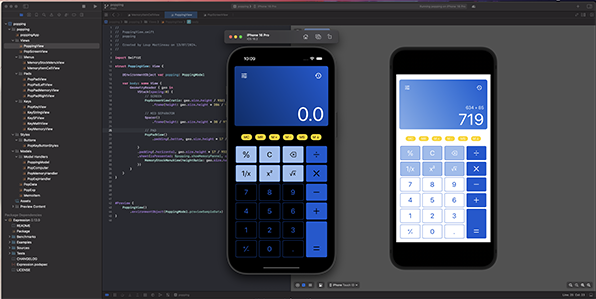
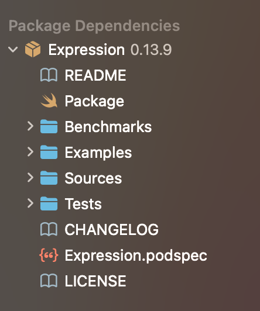
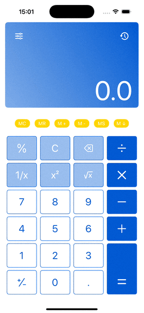
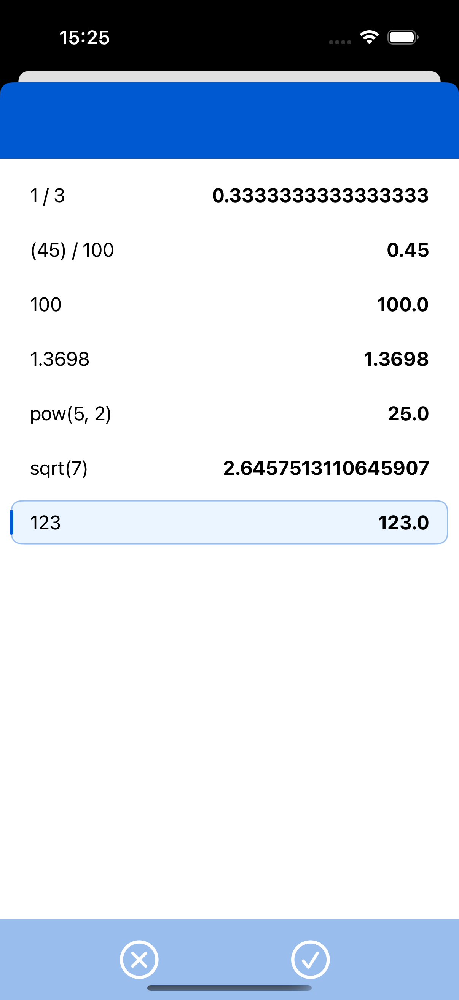
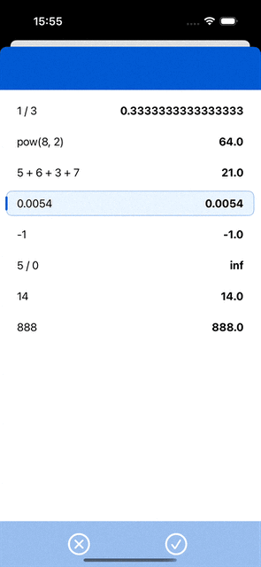
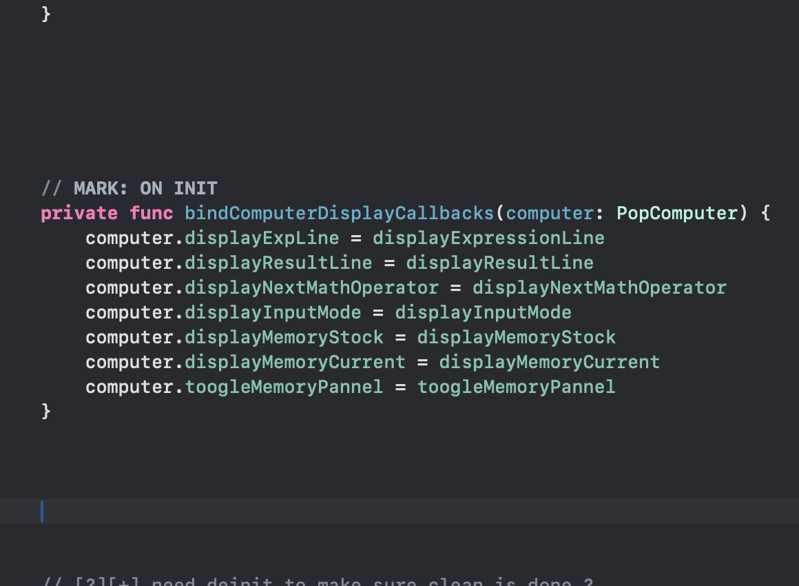

# Calpop : the compute machine

## Project overview

**`Calpop`** is an iOS app that offers a calculator. It's a rather classic training project for honing skills, written in **SwiftUI**.  

## Expression third party library

The [Expression Framework](https://github.com/nicklockwood/Expression) is easily integrated into the project using **Swift Package Manager**.

<table style="border: 0px;">
    <tr>
        <td >
        
 
            
            

        </td>
        <td>
            

                <h2><b>Expression Framework</b></h2>
                
 Used for parsing and evaluate mathematical expression in Calpop project.

            

        </td>
    </tr>
</table>

 

## Design

<table style="border: 0px;">
    <tr>
        <td>
            

                <h2><b>Let's talk about design</b></h2>
                
 A focus on achieving a <b>design</b> that is both functional and visually appealing, using a mockup created beforehand with <b>Sketch</b>.

            

        </td>
        <td>
        	
 
            
           

        </td>
    </tr>
</table>

## Real calclulator behaviour

Functionality inspired by a mix of the behaviors of calculators provided by macOS and Windows. The goal is to properly handle the **chaining of multiple calculations**. 

## Classic memory features

No button is decorative. The **memory functions** triggered by the yellow buttons are fully operational.

<table style="border: 0px;">
    <tr style="text-align:center;">
        <td>
        	<b>
            MS  
            Save memo entry
            </b>
        </td>
        <td>
        	<b>
            Mv  
            Select current memo 
            </b>
        </td>
        <td>
        	<b>
            MR   
            Recall current memo
            </b>
        </td>
    </tr>
    <tr>
        <td>
        	
 
            
           

        </td>
        <td>
        	
 
            
           

        </td>
        <td>
        	
 
            
           

        </td>
    </tr>
</table>

## Model architechture

<table style="border: 0px;">
    <tr>
        <td >
        
 
            
            

        </td>
        <td>
            

                <h2><b>Split responsabilities</b></h2>
                
From a <b>model architecture</b> perspective, I aimed to separate each feature into distinct classes, which are then all utilized by the main model through <b>dependency injection</b>.

            

        </td>
    </tr>
</table>

 